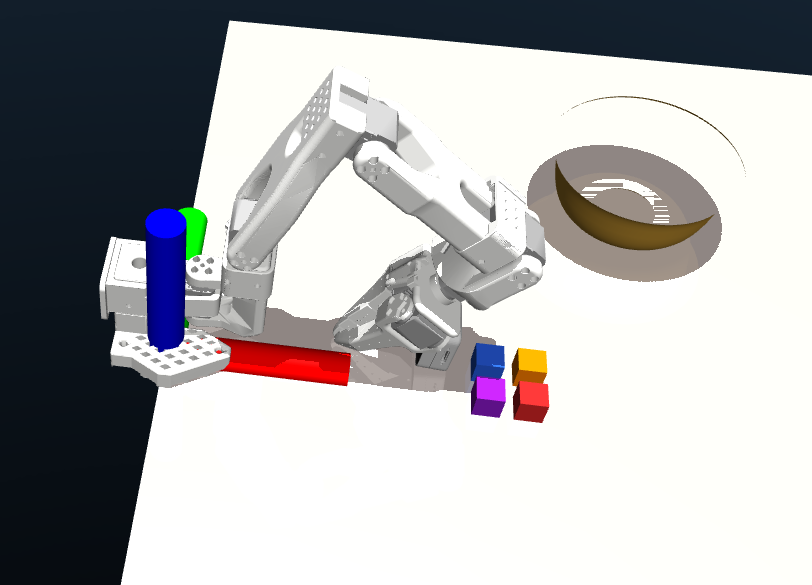

# SO101 MuJoCo — Observation & Action Space Reference

This document specifies the exact observation and action dictionaries that the
`rcs/so101_eval1/2/3` gymnasium environments produce and consume.  
Use it as the contract when wiring a trained policy into `examples/so101/policy_rollout.py`.

---

## Coordinate Frame

All poses are expressed in the **shared base frame**, which coincides with the
SO101 robot-base origin (the centre of the mounting plate).


```

The robot base is placed at MuJoCo world position `z = −0.03 m`; the
shared-base-frame origin therefore sits 3 cm above the MuJoCo floor.  
Object positions returned by the TA (bowl pose, cube targets) are given in
**this frame**.

---

## Observation Space

Each call to `env.step()` or `env.reset()` returns

```python
obs = {
    "robot": { ... }   # all fields listed below
}
```

### `obs["robot"]` fields

| Key       | Shape  | dtype   | Description |
|-----------|--------|---------|-------------|
| `tquat`   | (7,)   | float64 | Absolute TCP pose: `[x, y, z, qx, qy, qz, qw]` |
| `joints`  | (5,)   | float64 | Arm joint angles `[j1 … j5]` in radians |
| `xyzrpy`  | (6,)   | float64 | Absolute TCP pose: `[x, y, z, roll, pitch, yaw]` (radians) |
| `gripper` | (1,)   | float32 | Last gripper command: `0.0` = closed, `1.0` = open |
| `frames`  | dict   | —       | Camera observations (see below) |

### `tquat` — TCP pose (translation + quaternion)

```
[x,  y,  z,  qx, qy, qz, qw]
 ↑   ↑   ↑   └────────────┘
position   quaternion (xyzw convention)
(metres)   qw is the scalar / real part (last element)
```

Workspace bounds enforced by the action space:

| Component | Range |
|-----------|-------|
| x         | −0.855 … 0.855 m |
| y         | −0.855 … 0.855 m |
| z         | −1.000 … 1.188 m |
| qx, qy, qz, qw | unit-quaternion constraint (‖q‖ = 1) |

### `joints` — arm joint angles

```
[j1,  j2,  j3,  j4,  j5]
```

Joint 6 (gripper jaw) is **not** included here; its state is in `gripper`.

| Joint | Name           | Range (rad)           |
|-------|----------------|-----------------------|
| j1    | shoulder pan   | −1.920 … +1.920       |
| j2    | shoulder lift  | −1.920 … +1.920       |
| j3    | elbow flex     | −1.745 … +1.571       |
| j4    | wrist flex     | −1.658 … +1.658       |
| j5    | wrist roll     | −2.793 … +2.793       |

### `xyzrpy` — TCP pose (translation + Euler angles)

```
[x,  y,  z,  roll,  pitch,  yaw]
```

Same position as `tquat[:3]`, same orientation expressed as intrinsic RPY in
radians. Provided as an alternative representation for policies that prefer
Euler angles.

### `gripper` — binary gripper state

Reflects the **last command sent**, not the physical jaw width.

| Value | Meaning   |
|-------|-----------|
| 0.0   | Closed (grasping) |
| 1.0   | Open |

### `frames` — camera observations

The wrist camera produces an RGB image at every step.

```python
obs["robot"]["frames"]["wrist"]["rgb"] = {
    "data":       np.ndarray,  # shape (144, 256, 3), dtype uint8, RGB
    "intrinsics": np.ndarray,  # shape (3, 4),        dtype float64
    "extrinsics": np.ndarray,  # shape (4, 4),        dtype float64
}
```

| Field        | Details |
|--------------|---------|
| `data`       | `H × W × 3` uint8 RGB image, H=144, W=256 |
| `intrinsics` | 3×4 camera projection matrix `[K | 0]` |
| `extrinsics` | 4×4 camera-to-world homogeneous transform |

The camera corresponds to the Intel RealSense D405 attached to the gripper
body (`assets/cameras/d405/`).

---

## Action Space

```python
action = {
    "robot": {
        "tquat":   np.ndarray,  # shape (7,),  dtype float64
        "gripper": np.ndarray,  # shape (1,),  dtype float32
    }
}
```

### `action["robot"]["tquat"]` — relative Cartesian delta

The action is **relative to the current TCP pose** (mode: `CARTESIAN_TQuat`,
`RelativeTo.LAST_STEP`).

```
[Δx,  Δy,  Δz,  qx, qy, qz, qw]
 └──translation──┘  └─rotation──┘
    delta (metres)   orientation of the target pose
                     (absolute, not a delta)
```

| Component | Range | Notes |
|-----------|-------|-------|
| Δx        | −0.5 … +0.5 m | clipped before IK |
| Δy        | −0.5 … +0.5 m | clipped before IK |
| Δz        | −0.5 … +0.5 m | clipped before IK |
| qx, qy, qz, qw | unit quaternion | target end-effector orientation |

**Identity / stay-in-place action:**
```python
np.array([0.0, 0.0, 0.0,  0.0, 0.0, 0.0, 1.0])
#          Δxyz=0          identity rotation (qw=1)
```

How the delta is applied internally:
```
tcp_target.xyz  = tcp_current.xyz + clamp(Δxyz, −max_mov, +max_mov)
tcp_target.quat = q_delta * tcp_current.quat
```
where `max_mov = 0.5 m` (default; set via `max_relative_movement` in the
scene config).

### `action["robot"]["gripper"]` — binary gripper command

| Value | Action |
|-------|--------|
| 0.0   | Close (triggers `grasp()`) |
| 1.0   | Open  (triggers `open()`) |

Values are rounded (`np.round`) and clipped to `[0, 1]` internally, so any
float in `[0, 0.5)` closes the gripper and `[0.5, 1]` opens it.

---

## Proprioceptive Vector (flat)

If your policy consumes a flat float32 vector instead of the nested dict, the
default stacking order used by `TorchJITPolicy` is:

```
[tquat (7)  |  joints (5)  |  gripper (1)]   →  13-dimensional float32
```

Override `TorchJITPolicy.obs_keys` or `_build_input()` to change this.

---

## Info Dict

`env.step()` additionally returns `info["robot"]` with diagnostic fields:

| Key               | Type  | Description |
|-------------------|-------|-------------|
| `collision`       | bool  | True if any arm geom is in collision |
| `ik_success`      | bool  | True if IK converged for this step |
| `is_sim_converged`| bool  | True if physics converged |
| `gripper_width`   | float | Normalised gripper jaw width [0, 1] |
| `is_grasped`      | bool  | True if gripper is partially closed around an object |
| `success`         | bool  | Task success (Eval 1 only; see tasks.py) |

---

## Quick Reference — Zero Action

```python
ZERO_ACTION = {
    "robot": {
        "tquat":   np.array([0.0, 0.0, 0.0,  0.0, 0.0, 0.0, 1.0]),
        "gripper": np.array([0.0]),   # keep closed
    }
}
```

Sending this every step holds the arm at its current position.
